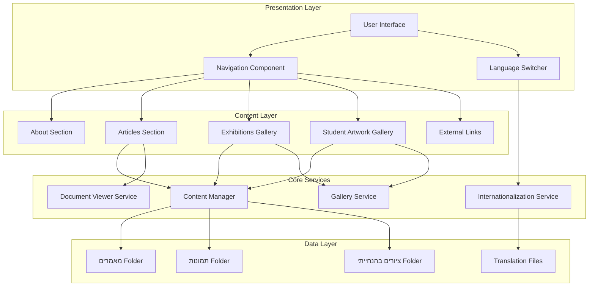

# Design Document: Portfolio Website

## Overview

The portfolio website is a bilingual (Hebrew/English) single-page application that showcases Ofra Seri's academic and artistic work. The application will be built using modern web technologies with a focus on responsive design, accessibility, and cultural authenticity through Yemenite art-inspired visual elements.

The architecture follows a component-based approach with clear separation between content management, presentation, and internationalization concerns. The website will support both RTL (Hebrew) and LTR (English) text directions, handle multiple document formats (PDF, DOCX), and provide an elegant gallery experience for viewing images.

## Architecture

### High-Level Architecture



### Technology Stack

**Frontend Framework:** React with TypeScript
- Component-based architecture for reusability
- Strong typing for maintainability
- Rich ecosystem for internationalization and galleries

**Styling:** CSS Modules with Sass
- Scoped styles to prevent conflicts
- Variables for theme consistency
- RTL/LTR support through directional styles

**Internationalization:** react-i18next
- Industry-standard i18n solution
- Support for RTL/LTR switching
- Namespace organization for content sections

**Document Viewing:** 
- PDF.js for PDF rendering
- Mammoth.js for DOCX conversion to HTML

**Image Gallery:** React-image-gallery or custom implementation
- Lightbox functionality
- Touch/swipe support for mobile
- Keyboard navigation

**Build Tool:** Vite
- Fast development server
- Optimized production builds
- Modern ES modules support

## Components and Interfaces

### 1. App Component

**Responsibility:** Root component managing global state and routing

**Interface:**
```typescript
interface AppState {
  currentLanguage: 'he' | 'en';
  currentSection: string;
}

interface AppProps {}

class App {
  state: AppState;
  
  handleLanguageChange(language: 'he' | 'en'): void;
  handleNavigationChange(section: string): void;
  render(): JSX.Element;
}
```

### 2. Navigation Component

**Responsibility:** Provides navigation between sections with active state indication

**Interface:**
```typescript
interface NavigationProps {
  currentSection: string;
  onNavigate: (section: string) => void;
  language: 'he' | 'en';
}

interface NavigationItem {
  id: string;
  labelKey: string;
  href: string;
}

class Navigation {
  props: NavigationProps;
  navigationItems: NavigationItem[];
  
  render(): JSX.Element;
}
```

### 3. Language Switcher Component

**Responsibility:** Toggles between Hebrew and English languages

**Interface:**
```typescript
interface LanguageSwitcherProps {
  currentLanguage: 'he' | 'en';
  onLanguageChange: (language: 'he' | 'en') => void;
}

class LanguageSwitcher {
  props: LanguageSwitcherProps;
  
  handleToggle(): void;
  render(): JSX.Element;
}
```

### 4. About Section Component

**Responsibility:** Displays biography and photo

**Interface:**
```typescript
interface AboutProps {
  language: 'he' | 'en';
}

interface AboutContent {
  photoUrl: string;
  biography: string;
}

class AboutSection {
  props: AboutProps;
  content: AboutContent;
  
  render(): JSX.Element;
}
```

### 5. Articles Section Component

**Responsibility:** Lists and provides access to academic articles

**Interface:**
```typescript
interface ArticlesProps {
  language: 'he' | 'en';
}

interface Article {
  id: string;
  filename: string;
  titleKey: string;
  fileType: 'pdf' | 'docx';
  filePath: string;
}

class ArticlesSection {
  props: ArticlesProps;
  articles: Article[];
  
  loadArticles(): Promise<Article[]>;
  handleArticleClick(article: Article): void;
  render(): JSX.Element;
}
```

### 6. Document Viewer Component

**Responsibility:** Renders PDF and DOCX documents

**Interface:**
```typescript
interface DocumentViewerProps {
  document: Article;
  onClose: () => void;
}

interface DocumentViewerState {
  isLoading: boolean;
  error: string | null;
  content: any;
}

class DocumentViewer {
  props: DocumentViewerProps;
  state: DocumentViewerState;
  
  loadDocument(): Promise<void>;
  renderPDF(): JSX.Element;
  renderDOCX(): JSX.Element;
  render(): JSX.Element;
}
```

### 7. Gallery Component

**Responsibility:** Displays image collections with lightbox functionality

**Interface:**
```typescript
interface GalleryProps {
  images: GalleryImage[];
  language: 'he' | 'en';
}

interface GalleryImage {
  id: string;
  thumbnailUrl: string;
  fullUrl: string;
  captionKey: string;
  alt: string;
}

interface GalleryState {
  selectedIndex: number | null;
  isLightboxOpen: boolean;
}

class Gallery {
  props: GalleryProps;
  state: GalleryState;
  
  handleThumbnailClick(index: number): void;
  handleNext(): void;
  handlePrevious(): void;
  handleClose(): void;
  render(): JSX.Element;
}
```

### 8. External Links Component

**Responsibility:** Displays list of external links

**Interface:**
```typescript
interface ExternalLinksProps {
  language: 'he' | 'en';
}

interface ExternalLink {
  id: string;
  titleKey: string;
  url: string;
}

class ExternalLinks {
  props: ExternalLinksProps;
  links: ExternalLink[];
  
  render(): JSX.Element;
}
```

### 9. Content Manager Service

**Responsibility:** Loads and organizes content from file system

**Interface:**
```typescript
interface ContentManagerConfig {
  articlesPath: string;
  exhibitionsPath: string;
  studentArtPath: string;
}

class ContentManager {
  config: ContentManagerConfig;
  
  loadArticles(): Promise<Article[]>;
  loadExhibitionImages(): Promise<GalleryImage[]>;
  loadStudentArtImages(): Promise<GalleryImage[]>;
  optimizeImage(imagePath: string, size: 'thumbnail' | 'full'): Promise<string>;
}
```

### 10. Internationalization Service

**Responsibility:** Manages translations and text direction

**Interface:**
```typescript
interface I18nConfig {
  defaultLanguage: 'he' | 'en';
  fallbackLanguage: 'en';
  translations: Record<string, any>;
}

class I18nService {
  config: I18nConfig;
  currentLanguage: 'he' | 'en';
  
  setLanguage(language: 'he' | 'en'): void;
  translate(key: string, params?: Record<string, any>): string;
  getDirection(): 'rtl' | 'ltr';
  getCurrentLanguage(): 'he' | 'en';
}
```

## Data Models

### Article Model

```typescript
interface Article {
  id: string;              // Unique identifier
  filename: string;        // Original filename
  titleKey: string;        // Translation key for title
  fileType: 'pdf' | 'docx'; // Document type
  filePath: string;        // Path to file
  dateAdded?: Date;        // Optional metadata
}
```

### Gallery Image Model

```typescript
interface GalleryImage {
  id: string;              // Unique identifier
  filename: string;        // Original filename
  thumbnailUrl: string;    // Optimized thumbnail URL
  fullUrl: string;         // Full-size image URL
  captionKey: string;      // Translation key for caption
  alt: string;             // Accessibility text
  width?: number;          // Original width
  height?: number;         // Original height
}
```

### External Link Model

```typescript
interface ExternalLink {
  id: string;              // Unique identifier
  titleKey: string;        // Translation key for title
  url: string;             // External URL
  descriptionKey?: string; // Optional description translation key
}
```

### Translation Model

```typescript
interface TranslationNamespace {
  navigation: {
    about: string;
    articles: string;
    exhibitions: string;
    studentArt: string;
    links: string;
  };
  about: {
    title: string;
    biography: string;
  };
  articles: {
    title: string;
    [articleKey: string]: string;
  };
  exhibitions: {
    title: string;
    [captionKey: string]: string;
  };
  studentArt: {
    title: string;
    [captionKey: string]: string;
  };
  links: {
    title: string;
    [linkKey: string]: string;
  };
}

interface Translations {
  he: TranslationNamespace;
  en: TranslationNamespace;
}
```

### Theme Configuration Model

```typescript
interface YemeniteTheme {
  colors: {
    primary: string;       // Warm terracotta
    secondary: string;     // Deep blue
    accent: string;        // Gold/amber
    background: string;    // Warm cream
    text: string;          // Dark brown
    textLight: string;     // Medium brown
  };
  typography: {
    headingFont: string;   // Decorative font for headers
    bodyFont: string;      // Readable font for content
    hebrewFont: string;    // Hebrew-optimized font
  };
  spacing: {
    unit: number;          // Base spacing unit (8px)
    sectionPadding: string;
    containerMaxWidth: string;
  };
  breakpoints: {
    mobile: string;        // 320px
    tablet: string;        // 768px
    desktop: string;       // 1024px
    wide: string;          // 1440px
  };
}
```

## Correctness Properties


*A property is a characteristic or behavior that should hold true across all valid executions of a system—essentially, a formal statement about what the system should do. Properties serve as the bridge between human-readable specifications and machine-verifiable correctness guarantees.*

### Property 1: Language-Direction Mapping

*For any* language selection, when Hebrew is selected the text direction should be RTL, and when English is selected the text direction should be LTR.

**Validates: Requirements 1.4, 1.5**

### Property 2: Content Language Consistency

*For any* content element (article titles, gallery captions, link titles, section text), when the language is switched, all visible content should display in the selected language.

**Validates: Requirements 1.3, 2.6, 3.5, 5.3**

### Property 3: Article Click Opens Viewer

*For any* article in the articles list, clicking on it should open the document viewer with that article loaded.

**Validates: Requirements 2.3**

### Property 4: Gallery Thumbnail Interaction

*For any* image thumbnail in any gallery (exhibitions or student artwork), clicking on it should open the lightbox view displaying the full-size version of that image.

**Validates: Requirements 3.3, 4.3**

### Property 5: External Links Target Behavior

*For any* external link in the links section, clicking on it should open the URL in a new browser tab (target="_blank").

**Validates: Requirements 5.2**

### Property 6: Language Change Propagation

*For any* language change event, all visible text content across all sections should update immediately to reflect the new language.

**Validates: Requirements 6.4**

### Property 7: Typography Consistency

*For any* two text elements of the same type (e.g., all headings, all body text), they should use the same font family and styling configuration.

**Validates: Requirements 7.3**

### Property 8: Color Contrast Accessibility

*For any* text element and its background, the color contrast ratio should meet WCAG AA standards (minimum 4.5:1 for normal text, 3:1 for large text).

**Validates: Requirements 7.5**

### Property 9: Responsive Layout Adaptation

*For any* screen width between 320px and 2560px, the layout should adapt without horizontal scrolling and all content should remain accessible.

**Validates: Requirements 8.1**

### Property 10: Navigation Link Functionality

*For any* navigation link, clicking it should navigate to or scroll to the corresponding section and update the active state indicator.

**Validates: Requirements 9.2**

### Property 11: Image Loading Placeholders

*For any* image that is in a loading state, a placeholder element should be visible until the image loads or fails.

**Validates: Requirements 10.2**

## Error Handling

### Document Loading Errors

**Scenario:** PDF or DOCX file fails to load or is corrupted

**Handling:**
1. Document viewer displays user-friendly error message in current language
2. Error message includes: "Unable to load document. Please try again later."
3. Provide "Close" button to dismiss viewer
4. Log error details to console for debugging
5. Do not crash the application

**Implementation:**
```typescript
class DocumentViewer {
  async loadDocument(): Promise<void> {
    try {
      const content = await this.fetchDocument(this.props.document.filePath);
      this.setState({ content, isLoading: false });
    } catch (error) {
      console.error('Document loading failed:', error);
      this.setState({ 
        error: this.i18n.translate('errors.documentLoadFailed'),
        isLoading: false 
      });
    }
  }
}
```

### Image Loading Errors

**Scenario:** Gallery image fails to load (404, network error, corrupted file)

**Handling:**
1. Display fallback placeholder image with icon indicating error
2. Include alt text for accessibility
3. Allow gallery navigation to continue working
4. Log error for monitoring
5. Retry loading on user request (optional)

**Implementation:**
```typescript
class GalleryImage {
  handleImageError(event: Event): void {
    const img = event.target as HTMLImageElement;
    img.src = '/assets/image-placeholder-error.svg';
    img.alt = this.i18n.translate('errors.imageLoadFailed');
    console.warn('Image failed to load:', this.props.image.fullUrl);
  }
}
```

### Language Loading Errors

**Scenario:** Translation file fails to load

**Handling:**
1. Fall back to English translations
2. Display warning banner: "Some translations unavailable"
3. Log error for monitoring
4. Retry loading translations in background
5. Application remains functional with fallback language

**Implementation:**
```typescript
class I18nService {
  async loadTranslations(language: string): Promise<void> {
    try {
      const translations = await fetch(`/locales/${language}.json`);
      this.translations[language] = await translations.json();
    } catch (error) {
      console.error('Translation loading failed:', error);
      // Fall back to English
      if (language !== 'en') {
        this.currentLanguage = 'en';
        this.showWarningBanner('translations.fallbackWarning');
      }
    }
  }
}
```

### Content Manager Errors

**Scenario:** Unable to load articles or images from folders

**Handling:**
1. Display empty state message: "No content available"
2. Provide retry button
3. Log error with details about which folder failed
4. Do not block other sections from loading
5. Show partial content if some items loaded successfully

**Implementation:**
```typescript
class ContentManager {
  async loadArticles(): Promise<Article[]> {
    try {
      const response = await fetch('/api/articles');
      if (!response.ok) throw new Error('Failed to fetch articles');
      return await response.json();
    } catch (error) {
      console.error('Articles loading failed:', error);
      this.showEmptyState('articles.noContent');
      return []; // Return empty array to prevent crashes
    }
  }
}
```

### Navigation Errors

**Scenario:** Navigation to non-existent section

**Handling:**
1. Scroll to top of page
2. Highlight first section (About) as active
3. Log warning about invalid section
4. Do not show error to user (graceful degradation)

### Responsive Layout Errors

**Scenario:** Viewport size detection fails or returns invalid values

**Handling:**
1. Default to mobile layout (safest fallback)
2. Log error for monitoring
3. Attempt to re-detect viewport size on window resize
4. Application remains functional with default layout

## Testing Strategy

### Overview

The testing strategy employs a dual approach combining unit tests for specific examples and edge cases with property-based tests for universal correctness properties. This comprehensive approach ensures both concrete functionality and general correctness across all inputs.

### Unit Testing

**Framework:** Vitest with React Testing Library

**Focus Areas:**
- Specific component rendering examples
- Edge cases and error conditions
- Integration between components
- Accessibility compliance
- User interaction flows

**Example Unit Tests:**

1. **About Section Rendering**
   - Test that photo placeholder renders
   - Test that biography text area is present
   - Test empty biography state

2. **Document Viewer**
   - Test PDF document opens correctly
   - Test DOCX document opens correctly
   - Test error state when document fails to load
   - Test close button functionality

3. **Gallery Components**
   - Test that exactly 15 exhibition images load
   - Test that exactly 16 student artwork images load
   - Test grid layout structure
   - Test navigation controls exist

4. **External Links**
   - Test that exactly 11 links render
   - Test links have proper ARIA labels
   - Test links have target="_blank" attribute

5. **Language Switcher**
   - Test Hebrew selection sets RTL direction
   - Test English selection sets LTR direction
   - Test language preference persists

6. **Navigation**
   - Test all 5 navigation links render
   - Test active section indicator
   - Test keyboard navigation support

7. **Responsive Behavior**
   - Test mobile navigation format at 375px width
   - Test gallery grid adjusts at mobile breakpoint
   - Test desktop layout at 1440px width

8. **Content Loading**
   - Test progressive image loading
   - Test placeholder displays during load
   - Test fallback placeholder on error
   - Test image optimization applied
   - Test content caching

### Property-Based Testing

**Framework:** fast-check (for TypeScript/JavaScript)

**Configuration:**
- Minimum 100 iterations per property test
- Each test tagged with feature name and property number
- Generators for random test data (languages, screen sizes, content)

**Property Test Implementation:**

Each correctness property from the design document must be implemented as a property-based test:

1. **Property 1: Language-Direction Mapping**
   ```typescript
   // Tag: Feature: portfolio-website, Property 1: Language-Direction Mapping
   test('language selection determines text direction', () => {
     fc.assert(
       fc.property(
         fc.constantFrom('he', 'en'),
         (language) => {
           const direction = getTextDirection(language);
           if (language === 'he') {
             expect(direction).toBe('rtl');
           } else {
             expect(direction).toBe('ltr');
           }
         }
       ),
       { numRuns: 100 }
     );
   });
   ```

2. **Property 2: Content Language Consistency**
   ```typescript
   // Tag: Feature: portfolio-website, Property 2: Content Language Consistency
   test('all content displays in selected language', () => {
     fc.assert(
       fc.property(
         fc.constantFrom('he', 'en'),
         fc.array(fc.string()), // Random content keys
         (language, contentKeys) => {
           setLanguage(language);
           const displayedContent = contentKeys.map(key => getTranslation(key));
           displayedContent.forEach(content => {
             expect(content).toMatchLanguage(language);
           });
         }
       ),
       { numRuns: 100 }
     );
   });
   ```

3. **Property 9: Responsive Layout Adaptation**
   ```typescript
   // Tag: Feature: portfolio-website, Property 9: Responsive Layout Adaptation
   test('layout adapts without horizontal scroll', () => {
     fc.assert(
       fc.property(
         fc.integer({ min: 320, max: 2560 }),
         (screenWidth) => {
           setViewportWidth(screenWidth);
           const hasHorizontalScroll = document.body.scrollWidth > screenWidth;
           expect(hasHorizontalScroll).toBe(false);
         }
       ),
       { numRuns: 100 }
     );
   });
   ```

**Test Data Generators:**

```typescript
// Generator for random languages
const languageGen = fc.constantFrom('he', 'en');

// Generator for random screen widths
const screenWidthGen = fc.integer({ min: 320, max: 2560 });

// Generator for random articles
const articleGen = fc.record({
  id: fc.uuid(),
  filename: fc.string(),
  titleKey: fc.string(),
  fileType: fc.constantFrom('pdf', 'docx'),
  filePath: fc.string()
});

// Generator for random gallery images
const galleryImageGen = fc.record({
  id: fc.uuid(),
  filename: fc.string(),
  thumbnailUrl: fc.webUrl(),
  fullUrl: fc.webUrl(),
  captionKey: fc.string(),
  alt: fc.string()
});

// Generator for random external links
const externalLinkGen = fc.record({
  id: fc.uuid(),
  titleKey: fc.string(),
  url: fc.webUrl()
});
```

### Integration Testing

**Focus:** End-to-end user flows

**Key Scenarios:**
1. User navigates through all sections
2. User switches language and verifies all content updates
3. User opens article, views it, closes viewer
4. User browses exhibition gallery, opens lightbox, navigates images
5. User browses student artwork gallery
6. User clicks external links
7. User resizes browser window and verifies responsive behavior

### Accessibility Testing

**Tools:**
- axe-core for automated accessibility testing
- Manual keyboard navigation testing
- Screen reader testing (NVDA/JAWS)

**Requirements:**
- All interactive elements keyboard accessible
- Proper ARIA labels on all controls
- Color contrast meets WCAG AA standards
- Images have descriptive alt text
- Focus indicators visible
- Semantic HTML structure

### Performance Testing

**Metrics:**
- First Contentful Paint < 1.5s
- Largest Contentful Paint < 2.5s
- Time to Interactive < 3.5s
- Cumulative Layout Shift < 0.1

**Tools:**
- Lighthouse for performance audits
- WebPageTest for detailed metrics
- Chrome DevTools for profiling

### Visual Regression Testing

**Tool:** Percy or Chromatic

**Coverage:**
- All sections in both languages
- Responsive breakpoints (mobile, tablet, desktop)
- Interactive states (hover, focus, active)
- Error states
- Loading states

### Test Coverage Goals

- Unit test coverage: > 80%
- Property test coverage: 100% of correctness properties
- Integration test coverage: All critical user flows
- Accessibility: 100% compliance with WCAG AA

### Continuous Integration

**Pipeline:**
1. Run unit tests on every commit
2. Run property tests on every commit
3. Run integration tests on pull requests
4. Run accessibility tests on pull requests
5. Run performance tests on main branch
6. Run visual regression tests on pull requests

**Quality Gates:**
- All tests must pass
- Coverage thresholds must be met
- No accessibility violations
- Performance budgets must be met
